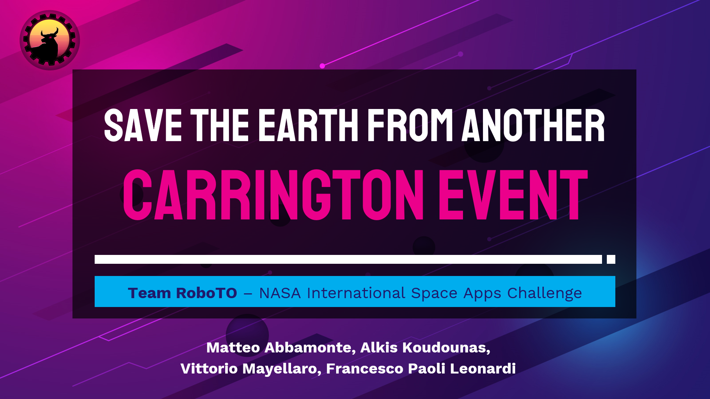

# **ρBerTO** -- A _RoboTO_ solution to the NASA Space Apps Challenge
Proposed solution for the "Save the Earth from another Carrington Event"

## High-Level Project Description
The project describes a Machine Learning approach for the Carrington Event data comprehension. 
We propose an innovative approach for tackling the problem of the prediction of symptoms related to possible Carrington Events, leveraging on a powerful Deep Learning Architecture. 
The proposed solution is based on a comparison between the data coming from the two main observatory spacecrafts actually employed, WIND and DSCOVER. It aims at improving the quality of the measurements of the DSCOVR spacecraft with a particular focus on an intelligent analysis of the solar wind behavior, by addressing a double task of "next event prediction" and "data trend analysis".
